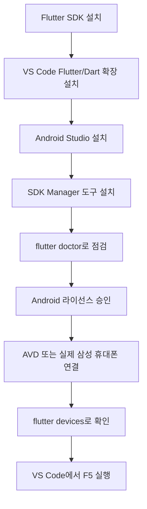

# OpenSoftware-Project
동양미래대학교 오픈소프트웨어 팀프로젝트 과제

## 팀원
- 20262708김동우
- 20261277송지율
- 20263165김나연
- 20261267최재민

## 프로젝트 소개

Flutter로 제작하는 한국어 단어 학습 애플리케이션입니다.

## 개발 환경

현재 프로젝트는 다음 환경에서 확인했습니다.

- Windows 10/11
- Flutter 3.47.5 (stable)
- Dart 3.13.4
- Android Studio
- Android SDK 36
- Android SDK Command-line Tools
- VS Code

## 설정 흐름



## 처음 설정하기

### 1. 필수 프로그램 설치

다음 프로그램을 설치합니다.

1. [Flutter SDK](https://docs.flutter.dev/get-started/install/windows)
2. [Android Studio](https://developer.android.com/studio)
3. [VS Code](https://code.visualstudio.com/)

VS Code에서는 Extensions에서 다음 확장을 설치합니다.

- Flutter (Dart Code)
- Dart (Flutter 설치 시 함께 설치될 수 있음)

설치 후 `Ctrl+Shift+P`를 누르고 `Flutter: New Project`를 검색하면 VS Code가 Flutter SDK 경로를 확인하도록 할 수 있습니다. 이미 이 저장소를 내려받은 경우에는 새 프로젝트를 만들 필요 없이 저장소 폴더를 VS Code로 열면 됩니다.

### 2. Android Studio 설정

Android Studio를 처음 실행한 뒤 SDK Manager에서 다음 항목을 설치합니다.

- Android SDK Platform
- Android SDK Build-Tools
- Android SDK Platform-Tools
- Android SDK Command-line Tools (latest)
- Android Emulator
- Android SDK NDK

이 프로젝트의 Android 빌드에 필요한 NDK 버전은 Flutter 설정에 따라 결정됩니다. 빌드 중 특정 NDK 버전이 없다는 메시지가 나오면 Android Studio의 SDK Manager에서 해당 버전을 추가로 설치합니다.

### 3. Android SDK 환경 변수 확인

일반적인 Android SDK 경로는 다음과 같습니다.

```text
C:\Users\<사용자이름>\AppData\Local\Android\sdk
```

Windows 환경 변수의 `Path`에 다음 경로를 추가하면 `adb`, `avdmanager`, `sdkmanager`를 터미널에서 사용할 수 있습니다.

```text
C:\Users\<사용자이름>\AppData\Local\Android\sdk\platform-tools
C:\Users\<사용자이름>\AppData\Local\Android\sdk\emulator
C:\Users\<사용자이름>\AppData\Local\Android\sdk\cmdline-tools\latest\bin
```

환경 변수를 변경한 뒤에는 VS Code를 완전히 종료하고 다시 실행합니다.

설정 확인:

```powershell
flutter doctor
adb --version
avdmanager --version
```

`flutter doctor`에서 Android toolchain과 Android licenses가 정상인지 확인합니다.

라이선스 승인 질문이 표시되는 환경에서는 다음 명령을 실행하고 각 질문에 `y`를 입력합니다.

```powershell
flutter doctor --android-licenses
```

최근 Android 도구에서는 `--licenses`가 더 이상 필요하지 않다는 경고가 표시될 수 있습니다. 경고만 표시되고 `flutter doctor`의 Android toolchain이 정상이라면 추가 조치는 필요하지 않습니다.

## 삼성 휴대폰 비율로 실행하기

### Android 에뮬레이터 사용

Android Studio에서 `Device Manager`를 열고 `Create Device`를 선택합니다.

삼성 Galaxy와 비슷한 화면 비율만 확인하려면 `New Hardware Profile`에서 다음처럼 설정할 수 있습니다.

```text
Name: Galaxy test device
Screen size: 6.2 inch
Resolution: 1080 x 2340
```

그 다음 Android 시스템 이미지를 선택하고 에뮬레이터를 생성합니다. 에뮬레이터를 실행한 뒤 프로젝트 폴더에서 다음 명령을 실행합니다.

```powershell
flutter devices
```

목록에 `emulator-5554`와 같은 Android 기기가 표시되면 다음처럼 실행합니다.

```powershell
flutter run -d emulator-5554
```

VS Code에서는 하단의 기기 선택 메뉴에서 Android 에뮬레이터를 선택한 뒤 `F5`를 눌러도 됩니다.

AVD는 삼성 One UI를 실행하는 장치가 아니므로 화면 크기와 비율 확인용입니다. 삼성의 실제 UI와 동작까지 확인하려면 USB 디버깅을 켠 실제 삼성 휴대폰을 연결합니다.

### 삼성 Galaxy Emulator Skin 사용

삼성 기기 외형과 버튼 배치까지 에뮬레이터에 표시하려면 삼성 공식 개발자 사이트에서 Galaxy Emulator Skin을 내려받을 수 있습니다.

1. [Samsung Developer](https://developer.samsung.com/)에 로그인합니다.
2. `Support` → `Galaxy Emulator Skin`에서 원하는 기종의 Skin을 내려받습니다.
3. 압축을 해제한 Skin 폴더를 다음 `skins` 폴더에 넣습니다.

```text
C:\Users\<사용자이름>\AppData\Local\Android\Sdk\skins
```

4. Android Studio의 `Device Manager` → `Create Device` → `New Hardware Profile`로 이동합니다.
5. 기기 화면 크기와 해상도를 입력하고 `Default Skin`의 폴더 선택 버튼으로 내려받은 Skin을 지정합니다.
6. Android 시스템 이미지와 API를 선택한 후 에뮬레이터를 생성합니다.

Skin은 에뮬레이터의 외형을 삼성 기기처럼 보여주는 기능입니다. One UI나 삼성 기기의 모든 동작을 재현하는 것은 아니므로, 최종 확인은 실제 기기에서도 진행해야 합니다.

### 실제 삼성 휴대폰 연결

1. 휴대폰의 설정에서 `휴대전화 정보` → `소프트웨어 정보`로 이동합니다.
2. `빌드 번호`를 7번 눌러 개발자 옵션을 활성화합니다.
3. 개발자 옵션에서 `USB 디버깅`을 켭니다.
4. USB 케이블로 PC에 연결하고 휴대폰에서 디버깅을 허용합니다.
5. 다음 명령으로 연결을 확인합니다.

```powershell
adb devices
flutter devices
```

## VS Code에서 실행하기

프로젝트 폴더를 VS Code로 연 뒤 터미널에서 의존성을 설치합니다.

```powershell
flutter pub get
```

실행 대상 확인:

```powershell
flutter devices
```

Android 기기 ID를 지정해 실행:

```powershell
flutter run -d <기기ID>
```

실행 중에는 저장하거나 터미널에서 `r`을 입력해 핫 리로드할 수 있습니다. 앱을 완전히 다시 시작해야 할 때는 `R`을 입력합니다.

## 테스트 및 검사

앱 코드 정적 분석:

```powershell
flutter analyze
```

위젯 테스트 실행:

```powershell
flutter test
```

`test/widget_test.dart`는 앱을 Android에서 실행하는 파일이 아니라, 위젯 동작을 자동으로 검증하는 테스트 파일입니다. Android 앱의 시작점은 `lib/main.dart`입니다.

## 문제 해결

### Android 기기가 `flutter devices`에 보이지 않는 경우

에뮬레이터가 실행 중인지 확인하고 ADB를 재시작합니다.

```powershell
adb kill-server
adb start-server
adb devices
flutter devices
```

기기 상태가 `offline`이면 에뮬레이터가 완전히 부팅될 때까지 기다린 뒤 다시 확인합니다.

### `Package ndk not found`가 나오는 경우

오류 메시지에 표시된 NDK 버전을 Android Studio의 SDK Manager에서 설치합니다. `sdkmanager`를 직접 사용하는 경우 Windows PowerShell에서는 다음처럼 패키지 ID를 입력합니다.

```powershell
sdkmanager --install "ndk/28.2.13676358"
```

버전은 오류 메시지에 표시된 값으로 바꿉니다.

### Java restricted method 경고가 나오는 경우

`java.lang.System::load` 관련 경고만 표시되고 빌드가 계속된다면 치명적인 오류가 아닙니다. `BUILD FAILED`가 함께 표시되는지 확인합니다.

## 참고 자료

아래 자료를 참고해 이 문서의 VS Code 및 삼성 에뮬레이터 설정 절차를 정리했습니다.

- [Flutter VS Code 설정하기](https://minibcake.tistory.com/556)
- [Android Studio에서 삼성 갤럭시 디바이스 에뮬레이터 추가](https://keepgoinglog.tistory.com/202)
- [Flutter 공식 Windows 설치 문서](https://docs.flutter.dev/get-started/install/windows)
- [Android Studio 공식 다운로드 페이지](https://developer.android.com/studio)
- [Samsung Developer 공식 사이트](https://developer.samsung.com/)

### Windows로 실행할 때 가로 화면으로 보이는 경우

Windows 실행 창은 `windows/runner/main.cpp`에서 기본 크기를 설정합니다. 현재 프로젝트는 휴대폰 세로 비율 확인을 위해 `393 x 852`로 설정되어 있습니다. Android 에뮬레이터 실행 시에는 실제 Android 기기의 화면 크기를 사용합니다.

## 변경 작업 규칙

- 사용자에게 보이는 문구는 한국어로 작성합니다.
- 단어 데이터와 학습 로직은 화면 코드와 분리합니다.
- 변경 후 `flutter analyze`와 관련 테스트를 실행합니다.
- 비밀키, 개인정보, 로컬 환경 파일은 커밋하지 않습니다.